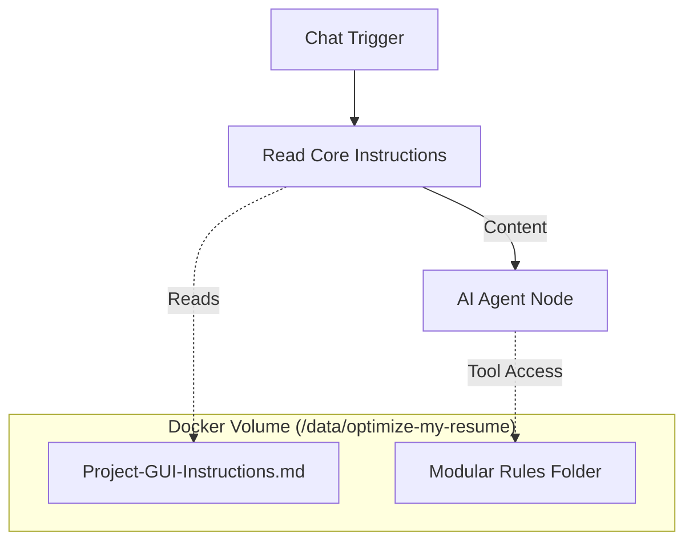

# n8n Agent Design Blueprint

## Core Concept: "The Knowledge-Infused Workflow"

To answer your question: **It is a Combination.**

You will build a **Workflow** that serves as the "Body", hosting an **AI Agent** which acts as the "Brain".

### Why a Combination?
- **The Workflow** handles the "plumbing": listening for chat messages, reading your rule files from the disk, and formatting them.
- **The Agent** handles the "thinking": understanding the user's intent and applying the rules to the resume content.

---

## Architecture Diagram

---

## Step-by-Step Implementation

### Step 1: The "System Prompt" Loader
We don't want the agent to "hallucinate" its instructions. We will **hard-code** the source of truth by reading it from the disk every time the workflow runs.

1.  **Node**: `Read/Write Files from Disk`
2.  **Operation**: Read File
3.  **File Path**: `/data/optimize-my-resume/Project-GUI-Instructions.md` (Lightweight) OR `PROJECT-INSTRUCTIONS.md` (Full)
4.  **Property**: `system_instructions`

### Step 2: The AI Agent Node
This is the heart of the system.

1.  **Node**: `AI Agent`
2.  **Model**: Connect your preferred Model (Claude 3.5 Sonnet or Gemini 1.5 Pro recommended).
3.  **System Message**: Use an Expression to pull from the specific file we read in Step 1.
    -   `{{ $('Read/Write Files from Disk').item.json.system_instructions }}`
    -   *Now your agent immediately "knows" who it is and what the rules are.*

### Step 3: Giving it "Tools" (Advanced)
If you want the agent to look up specific modular rules (like "How do I format a resume?"), give it a tool.

1.  **Node**: `Execute Command` (Converted to Tool)
2.  **Name**: `read_rule_file`
3.  **Description**: "Reads the content of a specific rule file. Use this when you need detailed constraints for a specific task."
4.  **Command**: `cat /data/optimize-my-resume/{{$fromAI("path")}}`

---

## Recommended "Personal Agent" Setup

For a true "Personal Agent" experience, use this configuration:

1.  **Trigger**: `Chat Trigger` (allows you to talk to it via web UI).
2.  **Memory**: `Window Buffer Memory` (so it remembers the conversation context).
3.  **Instruction Source**: `/data/optimize-my-resume/Project-GUI-Instructions.md` (Fast, optimized for agents).

### Why this is powerful
- **Zero-Maintenance**: When you update a markdown file in your repo (or via this coding session), your n8n agent *automatically* gets the latest version on the next run. No need to copy-paste instructions ever again!
