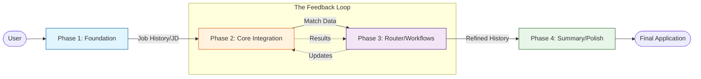

# Complete Workflow - Mermaid Journey

**Version:** 1.0
**Last Updated:** 2025-12-29

---

## Overview
The end-to-end journey of an optimized candidate. This diagram visualizes the modular nature of the v6.0 system, where each phase builds on the data artifacts of the previous one.

## Diagram

## Key Decision Points
- **Feedback Loop:** The system encourages refining Phase 3 (Bullet updates) based on Phase 2 (Gap Analysis) until the score is optimized.
- **Artifact Persistence:** File-based state allows users to stop after Phase 1 and return days later to finish Phase 4.

## Inputs
- Initial career data
- Specific target opportunities

## Outputs
- Optimized resume bullets
- Strategic career summaries
- Data-backed application materials

## Related Phases
- **Flow:** Logical progression through 4 distinct functional blocks.
