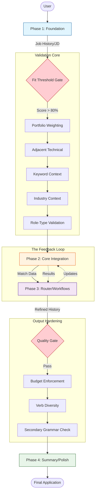

# Complete Workflow - Mermaid Journey

**Version:** 1.1 <!-- v1.1 Change: Added v6.3.x Guardrails and Core Modules -->
**Last Updated:** 2026-01-05

---

## Overview
The end-to-end journey of an optimized candidate. This diagram visualizes the modular nature of the v6.0 system, where each phase is reinforced by specific guardrails (Rules-as-Code) and validation modules.

## Diagram

## Key Decision Points
- **Fit Threshold Gate:** Evaluates if the candidate's core qualifications align enough to justify a deep dive.
- **Validation Core:** Five modules that prevent "LLM Optimism" (over-weighting portfolio projects or support roles).
- **Quality Gate:** Hard checks on character count (100-210), word count, and verb diversity.

## Inputs
- Initial career data
- Target opportunity JDs
- Portfolio projects (validated at 50% skill weight)

## Outputs
- Validated resume bullets
- Strategic career summaries
- Automated plain text export

## Related Phases
- **Flow:** Logical progression through 4 distinct functional blocks.
- **Integrity:** Guardrail #6 ensures backup/restore of data across every phase change.
