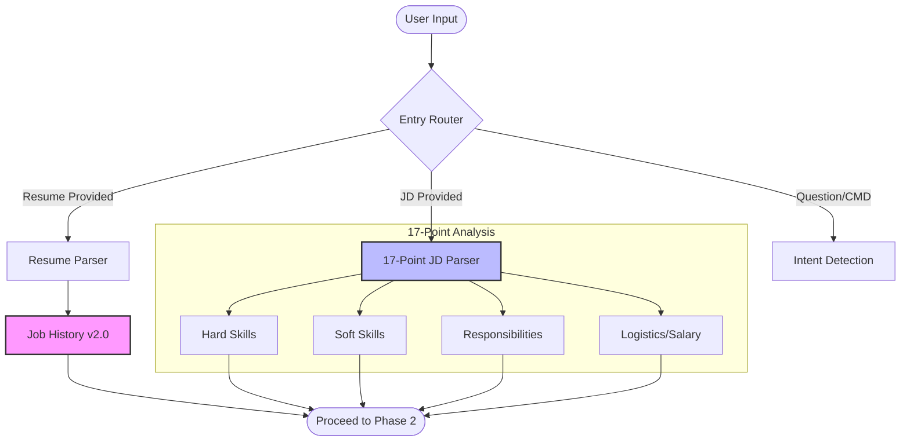

# Phase 1: Foundation - Mermaid Workflow

**Version:** 1.0
**Last Updated:** 2025-12-29
**Related Modules:** `phases/phase-1/`

---

## Overview
Phase 1 establishes the system's foundation by processing primary inputs: the user's resume (converted to Job History v2.0) and the targeted Job Description (parsed through a 17-point inspection).

## Diagram

## Key Decision Points
- **Parsing Strategy:** Uses highly structured schemas for both job history and job descriptions.
- **Skill Classification:** Initial separation of technical (hard) and behavioral (soft) assets.

## Inputs
- Raw Resume text
- Raw JD text

## Outputs
- Structured Job History (12 categories)
- Multi-dimensional JD profile

## Files Involved
- `phases/phase-1/job-history-v2.md`
- `phases/phase-1-jd-parser.md`
- `phases/phase-1-entry-router.md`

## Related Phases
- **Previous:** N/A (Entry Point)
- **Next:** **Phase 2: Core Integration**
