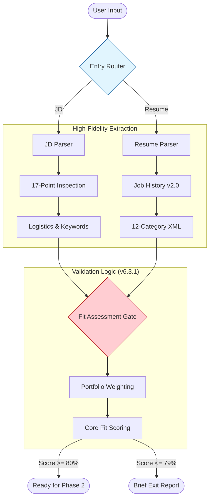

# Phase 1: Foundation - Mermaid Flow

**Version:** 1.1 <!-- v1.1 Change: Added v6.3.x Fit Gates and 17-Point Check Integration -->
**Last Updated:** 2026-01-05
**Related Modules:** `phases/phase-1/`, `core/fit-thresholds.md`

---

## Overview
Phase 1 focuses on high-fidelity extraction of data. By breaking down the JD into 17 points and the resume into 12 categories, the system ensures no critical requirement is missed before performing the initial Fit Assessment.

## Diagram

## Key Decision Points
- **Entry Routing:** Directs user to the correct workflow (Analysis vs optimization).
- **17-Point Check:** Identifies "Secret Requirements" often buried in JD text.
- **Fit Assessment:** Stops low-probability matches early to save user time and context tokens.

## Inputs
- Career history (Resume)
- Target role (JD)
- Role type (PM, BA, etc.)

## Outputs
- Structured Job History (12 categories)
- Multi-dimensional JD profile

## Files Involved
- `phases/phase-1/job-history-v2.md`
- `phases/phase-1-jd-parser.md`
- `phases/phase-1-entry-router.md`

## Related Phases
- **Previous:** N/A (Entry Point)
- **Next:** **Phase 2: Core Integration**
