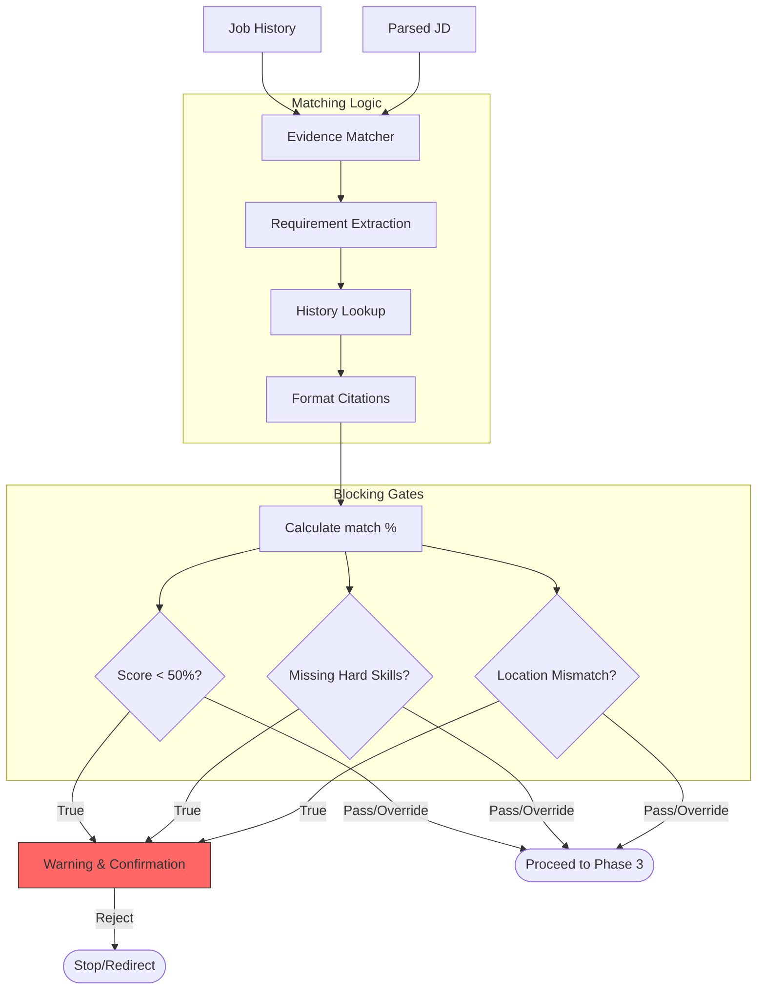

# Phase 2: Core Integration - Mermaid Workflow

**Version:** 1.0
**Last Updated:** 2025-12-29
**Related Modules:** `phases/phase-2/`

---

## Overview
Phase 2 performs the semantic matching between evidence and requirements. It uses high-confidence lookup to map resume achievements to JD needs, while protecting the user via safety gates.

## Diagram

## Key Decision Points
- **Hard Skill Enforcement:** System prioritizes technical hard skills over soft skills for the matching logic.
- **Location Check:** Specifically looks for "Remote" vs "On-site" contradictions.

## Inputs
- Structured Job History v2.0
- 17-Point Parsed JD

## Outputs
- Comprehensive Gap Analysis
- Match Score (0-100)
- Detailed Evidence Table

## Files Involved
- `phases/phase-2/evidence-matching.md`
- `phases/phase-2-blocking-gates.md`

## Related Phases
- **Previous:** **Phase 1: Foundation**
- **Next:** **Phase 3: Router & Workflows**
