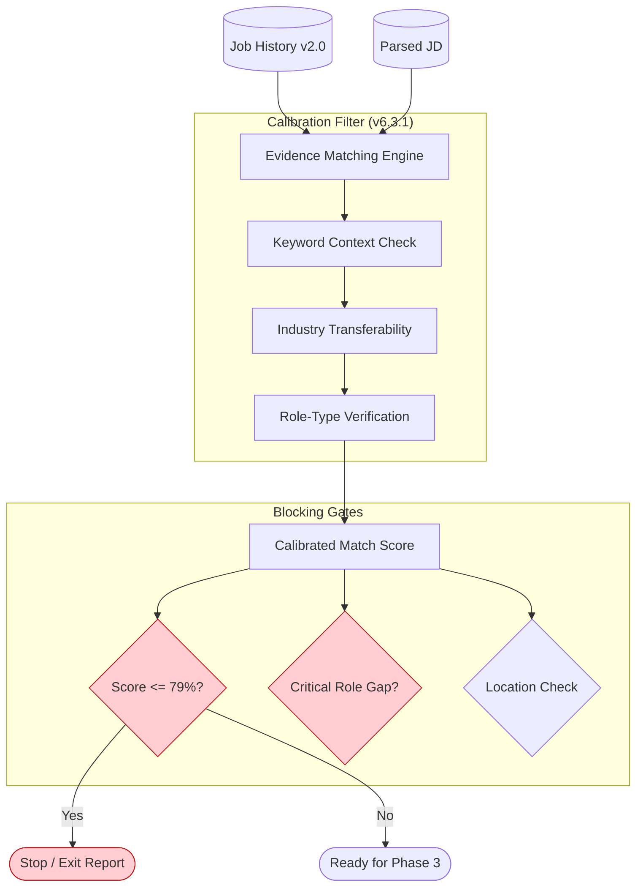

# Phase 2: Core Integration - Mermaid Flow

**Version:** 1.1 <!-- v1.1 Change: Added Calibrated Scoring (Industry, Role, Context) -->
**Last Updated:** 2026-01-05
**Related Modules:** `optimization-tools/bullet-optimizer/`, `core/adjacent-technical.md`, `core/industry-context.md`

---

## Overview
Phase 2 transforms raw job history into JD-specific evidence. It acts as the "Scientific Layer" of the system, applying rigid context and industry rules to ensure the resulting match score is accurate and defensible.

## Diagram

## Key Decision Points
- **Context Filtering:** Differentiates between primary contributors and documentarians.
- **Economic Penalties:** Applies score deductions for industry mismatches using the Transferability Matrix.
- **Strict Stop:** Unlike earlier versions, 6.3.1 enforces a hard "Exit" if the score is ≤79% (Stop Tier).

## Inputs
- Validated Job History (XML format)
- Target keywords with context requirements
- Experience targets (New Grad vs Senior)

## Outputs
- Evidence Audit Map
- Gap Assessment (Risk/Tweak categories)
- Calibrated Fit Score

## Files Involved
- `optimization-tools/bullet-optimizer/evidence-matching.md`
- `optimization-tools/bullet-optimizer-blocking-gates.md`
- `core/adjacent-technical.md`
- `core/industry-context.md`
- `core/role-type-validation.md`

## Related Phases
- **Previous:** Phase 1: Foundation
- **Next:** Phase 3: Router & Workflows
