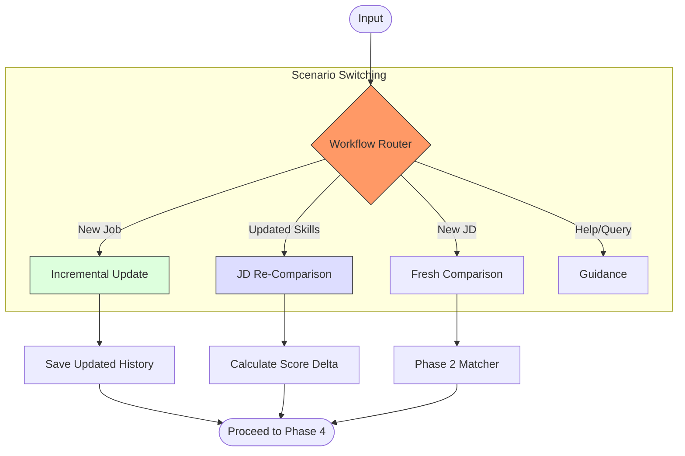

# Phase 3: Router & Workflows - Mermaid Workflow

**Version:** 1.0
**Last Updated:** 2025-12-29
**Related Modules:** `phases/phase-3/`

---

## Overview
Phase 3 manages the dynamic state of the consultation. It handles the "inner loop" of resume iteration—updating history, checking matches, and calculating improvements.

## Diagram

## Key Decision Points
- **Incremental Logic:** When adding a job, the system recalculates aggregate metrics (total years, total companies) without manual input.
- **Cache Management:** Re-comparison relies on cached JD metadata to avoid asking the user to re-paste the job description.

## Inputs
- User data updates (new bullets/roles)
- JD Cache (`jd_parsed/` directory)
- Versioned match history

## Outputs
- Delta match reports
- Recalculated career metrics
- State-aware greeting messages

## Files Involved
- `phases/phase-3/workflow-router.md`
- `phases/phase-3/incremental-updates.md`
- `phases/phase-3/re-comparison.md`

## Related Phases
- **Previous:** **Phase 2: Core Integration**
- **Next:** **Phase 4: Summary & Polish**
