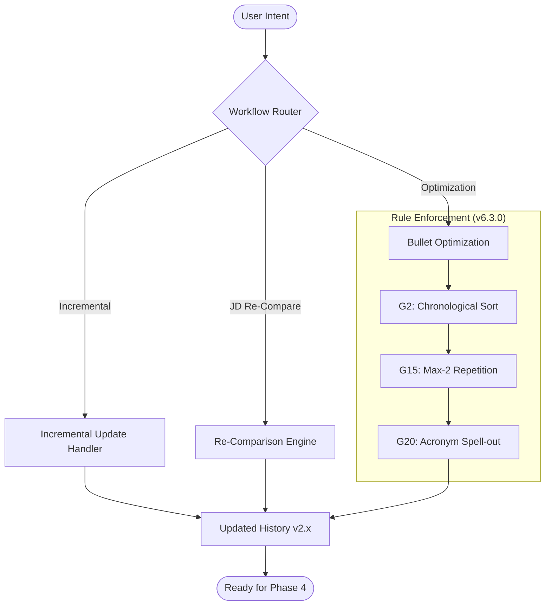

# Phase 3: Router & Workflows - Mermaid Flow

**Version:** 1.1 <!-- v1.1 Change: Added Bullet Optimization & Guardrail Integration -->
**Last Updated:** 2026-01-05
**Related Modules:** `phases/phase-3/`, `core/format-rules.md`

---

## Overview
Phase 3 manages state transitions and bullet refinement. It uses the Workflow Router to select the appropriate specialized logic while funneling all bullet generation through a rigorous set of v6.3.x constraints.

## Diagram

## Key Decision Points
- **Scenario Handling:** Routes complex requests (like "add a job") to dedicated sub-workflows to prevent context contamination.
- **Reverse Chronological Enforcement:** Guardrail #2 validates that Position 1 is always the most recent before any output is generated.
- **Anti-Repetition:** Guardrail #15 prevents "LLM Laziness" where the same impactful phrase is copied across multiple job bullets.

## Inputs
- Current validated state (HasHistory, HasJD)
- Optimization targets (Keywords)
- Chronological data (Dates)

## Outputs
- Delta match reports
- Recalculated career metrics
- State-aware greeting messages

## Files Involved
- `phases/phase-3/workflow-router.md`
- `phases/phase-3/incremental-updates.md`
- `phases/phase-3/re-comparison.md`

## Related Phases
- **Previous:** **Phase 2: Core Integration**
- **Next:** **Phase 4: Summary & Polish**
