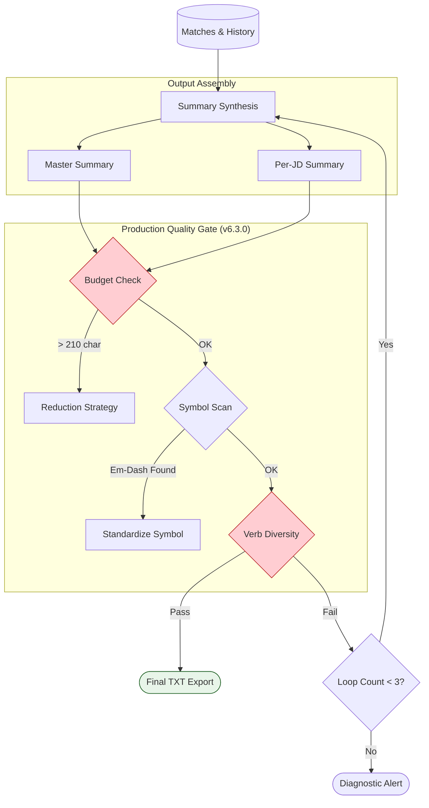

# Phase 4: Summary & Polish - Mermaid Flow

**Version:** 1.1 <!-- v1.1 Change: Added Budget Enforcement & Quality Gates -->
**Last Updated:** 2026-01-05
**Related Modules:** `phases/phase-4/`, `core/format-rules.md`

---

## Overview
Phase 4 acts as the "Assembly Line" where optimized components are combined into a final product. Every document must pass through a Quality Gate that strictly enforces the character budget (Guardrail #8) and symbol standards (Guardrail #22).

## Diagram

## Key Decision Points
- **Budget Enforcement:** If the document is too long (>500 words), the system automatically prunes older roles (Rule #8).
- **Infinite Loop Prevention:** Guardrail #14 ensures the system doesn't get stuck in a "Regeneration Loop" and alerts the user if standards can't be met.
- **Formal Export:** The system automatically generates a `.txt` version ready for copy-pasting into ATS portals.

## Inputs
- Career Profile
- Gap Analysis Results
- Word Count Limits

## Outputs
- Reusable "Master Summary"
- Customized "Per-JD Summary"

## Files Involved
- `phases/phase-4/summary-generation.md`

## Related Phases
- **Previous:** **Phase 3: Router & Workflows**
- **Next:** N/A (Project Exit)
