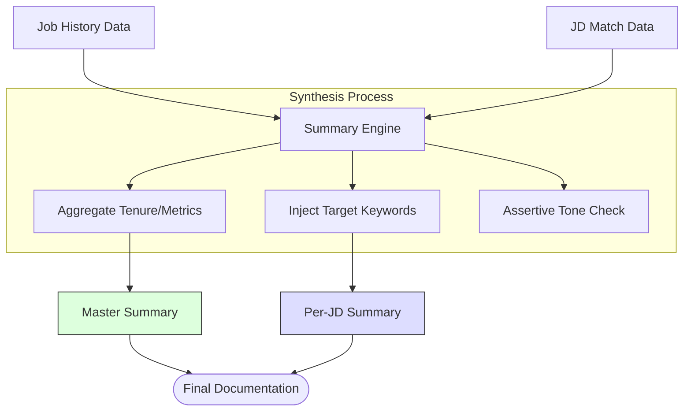

# Phase 4: Summary & Polish - Mermaid Workflow

**Version:** 1.0
**Last Updated:** 2025-12-29
**Related Modules:** `phases/phase-4/`

---

## Overview
Phase 4 handles the final synthesis of the candidate's professional brand. It bridges the gap between raw data and high-impact storytelling.

## Diagram

## Key Decision Points
- **Constraint Handling:** If the generated summary exceeds 350 characters, the engine intelligently truncates secondary technical skills to keep the opening sentence impactful.
- **Metric Injection:** Specifically looks for the most "impressive" aggregate metric (e.g., "Led 15+ launches") to lead the summary.

## Inputs
- Aggregated career data
- Specific job requirements

## Outputs
- Reusable "Master Summary"
- Customized "Per-JD Summary"

## Files Involved
- `phases/phase-4/summary-generation.md`

## Related Phases
- **Previous:** **Phase 3: Router & Workflows**
- **Next:** N/A (Project Exit)
