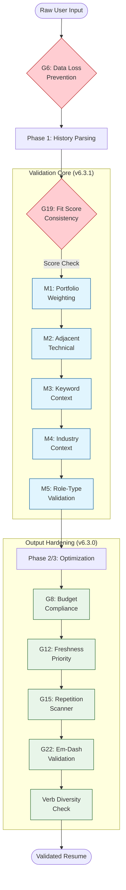

# Rules and Guardrails - Mermaid Flow

**Version:** 1.0 <!-- v1.0 Initial: Mapping v6.3.x Guardrail Flows -->
**Last Updated:** 2026-01-05

---

## Overview
This diagram visualizes the "Phased Defense" strategy of the system, showing how different guardrails engage at different stages of the optimization process.

## Diagram

## Guardrail Stages

1.  **Ingestion Protection (Red):** `G#6` and `G#19` ensure the system doesn't lose data or provide delusional fit scores based on weak evidence.
2.  **Calibrated Assessment (Blue):** The `Validation Core` (M1-M5) applies specific weights and masks to the candidate's history to ensure "Technical Writer" isn't matched as "Senior Software Engineer" without genuine evidence.
3.  **Production Hardening (Green):** Hard formatting rules ensure the output is technically perfect for ATS (Applicant Tracking Systems), including character counts and symbol consistency.

## Priority Legend
- **CRITICAL:** Will stop execution or trigger mandatory regeneration (G#6, G#8, G#19, M3, M5).
- **HIGH:** Flags issues to user or applies significant score penalties (M1, M2, M4, G#12, G#15).
- **MODERATE:** Routine formatting and polish (G#20, G#22).
